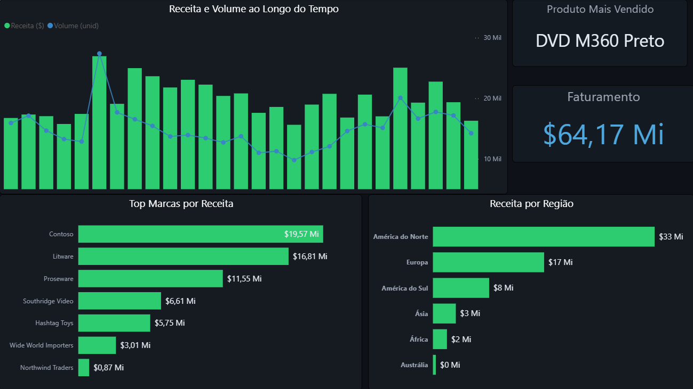
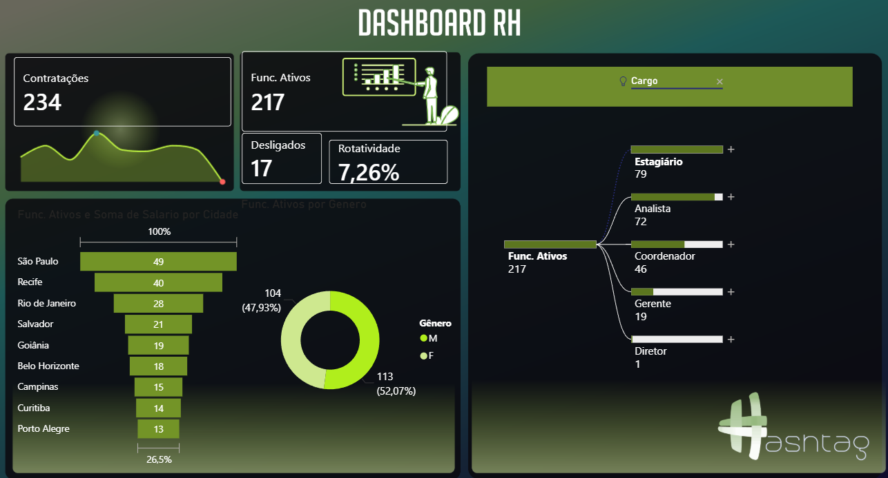

# PowerBI Intensivo Hashtag

## Sobre o Projeto

Este repositório reúne dashboards desenvolvidos durante o Intensivo de Power BI da Hashtag Treinamentos, com foco na construção de análises orientadas a dados e desenvolvimento de soluções interativas para diferentes áreas de negócio.

Os projetos abordam cenários reais de análise, incluindo vendas, produção e recursos humanos, utilizando boas práticas de modelagem de dados, criação de KPIs e visualização estratégica.

---

## Preview dos Projetos

### Dashboard de Vendas


### Dashboard de Produção


### Dashboard de RH


---
## Projetos

### Dashboard de Vendas

Análise de desempenho comercial com foco em faturamento, regiões e marcas.

Principais pontos:

* Evolução da receita ao longo do tempo
* Comparação de desempenho por região
* Ranking de marcas por faturamento

Estrutura:
```
📁 dashboard-vendas
┣ 📄 dashboard.pbix
┣ 📄 preview.png
┗ 📄 vendas.xlsx
```
---
### Dashboard de Produção

Monitoramento de indicadores produtivos para avaliação de eficiência operacional.

Principais pontos:

* Controle de qualidade e disponibilidade
* Análise de horas produtivas e paradas
* Identificação de perdas operacionais


Estrutura:
```
📁 dashboard-producao
┣ 📄 dashboard.pbix
┣ 📄 preview.png
┗ 📄 README.md
```
---

### Dashboard de RH

Análise de indicadores de recursos humanos com foco em estrutura organizacional e rotatividade.

Principais pontos:

* Acompanhamento de contratações e desligamentos
* Distribuição de colaboradores por cidade e cargo
* Análise de rotatividade

Estrutura:
```
📁 dashboard-rh
┣ 📄 dashboard.pbix
┣ 📄 preview.png
┗ 📄 README.md
```
---

## Tecnologias Utilizadas

* Power BI
* DAX (Data Analysis Expressions)
* Excel
* Modelagem de dados

---

## Como Utilizar

* Acesse a pasta do projeto desejado
* Baixe o arquivo `.pbix` correspondente
* Abra no Power BI Desktop
* Atualize as fontes de dados, se necessário
* Explore os dashboards utilizando os filtros interativos

---

## Principais Aprendizados

* Construção de dashboards interativos
* Criação de KPIs e métricas com DAX
* Modelagem e tratamento de dados
* Desenvolvimento de análises voltadas para tomada de decisão
* Organização de projetos de dados para portfólio

---

## Observações

Os dados utilizados nos projetos são simulados e têm como objetivo a prática de análise de dados e desenvolvimento de dashboards.

---

## Autor

Roberto Sulkovski
[www.linkedin.com/in/roberto-sulkovski-roxo](http://www.linkedin.com/in/roberto-sulkovski-roxo)

---

## Contribuição

Sugestões e melhorias são bem-vindas.
