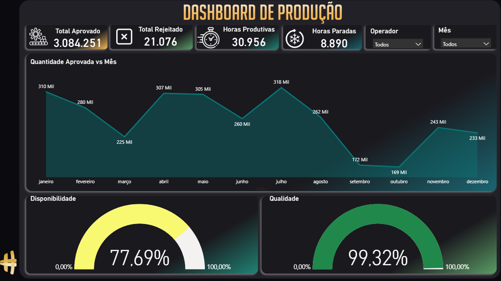

# Dashboard de Produção (Power BI)

## Preview



---

## Objetivo

Desenvolver um dashboard interativo para monitoramento de indicadores produtivos, permitindo identificar variações de desempenho, perdas operacionais e oportunidades de otimização no processo.

---

## Principais Indicadores (KPIs)

* **Total Aprovado**: Volume total de itens produzidos com sucesso
* **Total Rejeitado**: Volume de itens com falha ou não conformidade
* **Horas Produtivas**: Tempo efetivamente utilizado na produção
* **Horas Paradas**: Tempo de inatividade operacional
* **Disponibilidade (%)**: Relação entre tempo produtivo e tempo total
* **Qualidade (%)**: Percentual de itens aprovados sobre o total produzido

---

## Visualizações

O dashboard inclui:

* Gráfico de área para análise da evolução da produção ao longo dos meses
* Medidores (gauge) para acompanhamento de disponibilidade e qualidade
* Filtros interativos por operador e período (mês)

---

## Tecnologias Utilizadas

* Power BI
* DAX (Data Analysis Expressions)
* Modelagem de dados

---

## Estrutura do Projeto

```
📁 dashboard-producao
 ┣ 📄 preview.png
 ┣ 📄 dashboard.pbix
 ┗ 📄 README.md
```

---

## Como Utilizar

1. Baixe o arquivo `.pbix`
2. Abra no Power BI Desktop
3. Atualize as fontes de dados, se necessário
4. Utilize os filtros para explorar os dados

---

## Principais Aprendizados

* Criação de medidas e KPIs utilizando DAX
* Modelagem e tratamento de dados
* Construção de dashboards com foco em clareza e usabilidade
* Aplicação de filtros e interatividade

---

## Observações

Dashboard desenvolvido a partir de dados de produção simulados, com foco na análise de variações mensais e no impacto das paradas operacionais sobre os resultados.

---

## Autor

Roberto Sulkovski
www.linkedin.com/in/roberto-sulkovski-roxo

---

## Contribuição

Sugestões e melhorias são bem-vindas.

